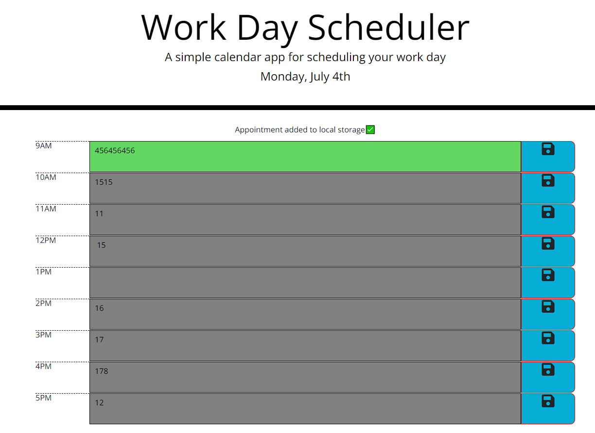

# workdayScheduler

## Link to the deployed application
https://kbjss071.github.io/workdayScheduler/
 

 

## To-do lists
- The current day should be displayed on the top of the screen.
- Timeblocks for standard business hours should be displayed under the current day.
- Each time block has a color to display if the time is in past, present, or future.
- Each time block can be inserted with a text describing an event.
- When the save button is clicked, the text for that event is stored in local storage.
- When the page is refreshed, the saved text should be displayed in the timeblock.

 

## Works done in the project
- By using moment.js, the current day feature is added to the top of the screen.
- Added timeblocks div elements for each time-block in the html file.
- Added div elements for time, todo textbox, and save button.
- Added some styles in div elements.
- When user writes some input in the todo textbox and saves the text, the text will be stored in local storage.
- When user refreshes the page, the stored input will be displayed in each todo textbox.
- Timeblock:
    - When the timeblock is unavailable, the background color of the text box will be grey.
    - When the timeblock is on the present time, the background color will be red.
    - When the timeblock is available, the background color will be green.